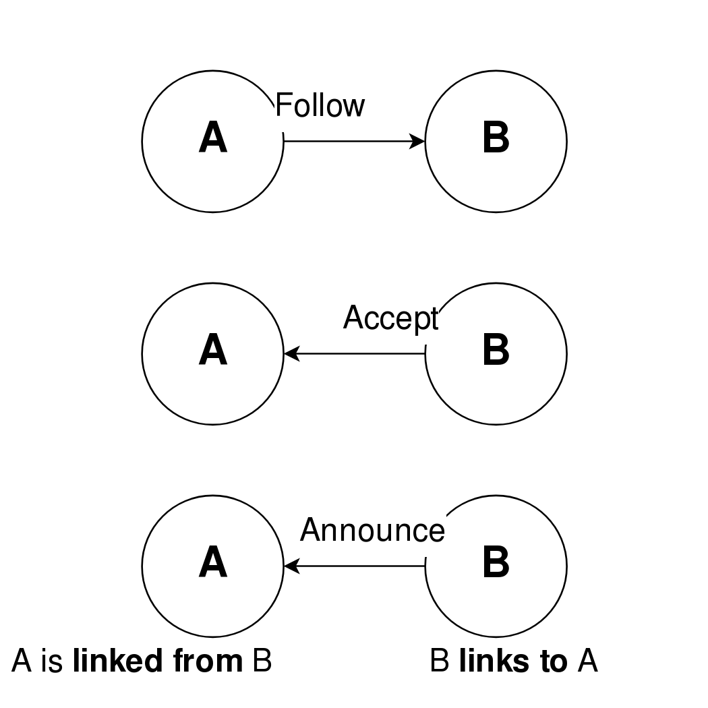

# FEP-2100: Unbound Group and Organization

This FEP wasn't a result of my individual work but rather of the joint effort in this [SocialHub discussion](https://socialhub.activitypub.rocks/t/decentralised-group/2200) and, prior to that, the discussion in GNU social's IRC/XMPP with rozzin (Joshua Judson Rosen) and someonewithpc (Hugo Sales).


## Summary

Historically, after the sudden death of a popular instance, one could neither target groups hosted at it anymore nor contact the whole followers collection to let them know of the new instance housing a certain group. If we always have absolute knowledge of the complete followers collection (or good enough), we can automate based on which instance has more local followers which server would become the new house. Another alternative would be to automatically archive the old group and start again from scratch.

This FEP, on the other hand, discusses something very different of automatically moving an actor from one server to a different one. It is about collaboration between different group or organization actors to promote an unified experience between the participants of the linked group actors. We think this may be easier, more flexible, and promote a better UX than only notifying the actor that the house of a certain group has moved, but both solutions would probably achieve similar results in the above use case.

This proposal introduces an interpretation of a Group following another Group and the `gs:unbound` attribute. This allow two groups (or organization) to "act as one" (not exactly, but elaborated afterwards).

This primarily aims at effectively removing a central point of authority for groups, but offers more than that. With this, `@alice@undefinedhackers.net` can mention a group named hackers (!hackers) or even address an activity To `!hackers@instance.gnusocial.test` (C2S) and let her instance's !hackers announce to other instances' !hackers.

Finally, this proposal is general enough to allow a server to simultaneously have `!lug@server` (without links), `!lug-unbound@server` (with the greatest links collection it can grow), and `!lug-with-some-links@server` (with only some links). It doesn't require linked groups to have the same `preferredUsername`.


## Notation and Definitions

To keep things simple, sometimes you will see things formatted like `Activity{Object}`. For example, `Create{Note}` would be a `Create` activity containing a `Note` in the object field.
Also, we will focus in Actor of type `Group`, but nothing should stop from using this for `Organization`.

* `@nickname@server` will be used to refer Actors of type Person or Application.
* `!nickname@server` will be used to refer Actors of type Group or Organization.
* `@#!group@server#collection` will be used to refer collection `collection` of `!group@server`.

The key words MAY, MUST, MUST NOT, SHOULD, and SHOULD NOT are to be interpreted as described in [RFC2119].


### Links between Groups terminology




## ActivityStreams 2.0 requirements for this mechanism


### Example Group Actor in this FEP

```json
{
  "type": "Group",
  "streams": [],
  "@context": [
    "https://www.w3.org/ns/activitystreams",
    {
      "gs": "https://www.gnu.org/software/social/ns#"
    },
    {
      "unbound": {
        "@id": "gs:unbound",
        "@type": "@id"
      }
    }
  ],
  "id": "https://instance.gnusocial.test/group/hackers",
  "unbound": true,
  "preferredUsername": "hackers",
  "endpoints": {
    "sharedInbox": "https://instance.gnusocial.test/inbox.json"
  },
  "inbox": "https://instance.gnusocial.test/group/hackers/inbox.json",
  "outbox": "https://instance.gnusocial.test/group/hackers/outbox.json",
  "following": "https://instance.gnusocial.test/group/hackers/subscriptions",
  "followers": "https://instance.gnusocial.test/group/hackers/subscribers",
}
```


## Creating a link between two group actors

Creating a directed link between two group actors is just a regular Follow request between any two actors.

Assume that `!hackers@instance.gnusocial.test` sends a Follow request to `!lug@gnusocial.net`.

If `gs:unbound: false` or not present, then if `!lug@gnusocial.net` accepts the Follow request, it will Announce{*} entering its inbox to `!hackers@instance.gnusocial.test`.

If `gs:unbound: true`, then `!lug@gnusocial.net` will both accept the Follow request and submit a Follow request of its own to `!hackers@instance.gnusocial.test`.

If both `!hackers@instance.gnusocial.test` and `!lug@gnusocial.net` have added each other to their linksTo, they will act as if they were the same group. If they have equivalent `groupLinks` collections, then they are essentially fully mirrored groups.

_Note_ that the "Link negotiation" happens between two Group actors (S2S).


### Some scenarios


#### 1. Group A follows Group B which has `gs:unbound = false`

- A SHOULD NOT attempt to Follow B;
- If B receives a Follow from A, it SHOULD reject.


#### 2. Group A follows Group B which has `gs:unbound = true`

- A SHOULD send a Follow to B;
- B SHOULD Accept;
- B SHOULD Follow A, if A has `gs:unbound = true`.


#### 3. Group A follows Group B which has no `gs:unbound` attribute

- A SHOULD send a Follow to B;
- B MAY Accept.


#### 4. Forwarding from Inbox

- `!hackers@`**C**: Announce{Note} _TO_ `!hackers@`**[B]** (S2S)
- **B** MUST NOT forward this to other groups. If other groups expect to receive this activity, then they must follow `!hackers@`**C** as well.


## References

- [ActivityPub] Christine Lemmer Webber, Jessica Tallon, [ActivityPub](https://www.w3.org/TR/activitypub/), 2018
- [ActivityStreams Vocabulary] James M Snell, Evan Prodromou, [ActivityStreams Vocabulary](https://www.w3.org/TR/activitystreams-vocabulary/#h-modeling-friend-requests), 2017
- [RFC-2119] S. Bradner, [Key words for use in RFCs to Indicate Requirement Levels](https://tools.ietf.org/html/rfc2119.html), 1997


## Copyright

CC0 1.0 Universal (CC0 1.0) Public Domain Dedication

To the extent possible under law, the authors of this Fediverse Enhancement Proposal have waived all copyright and related or neighboring rights to this work.
